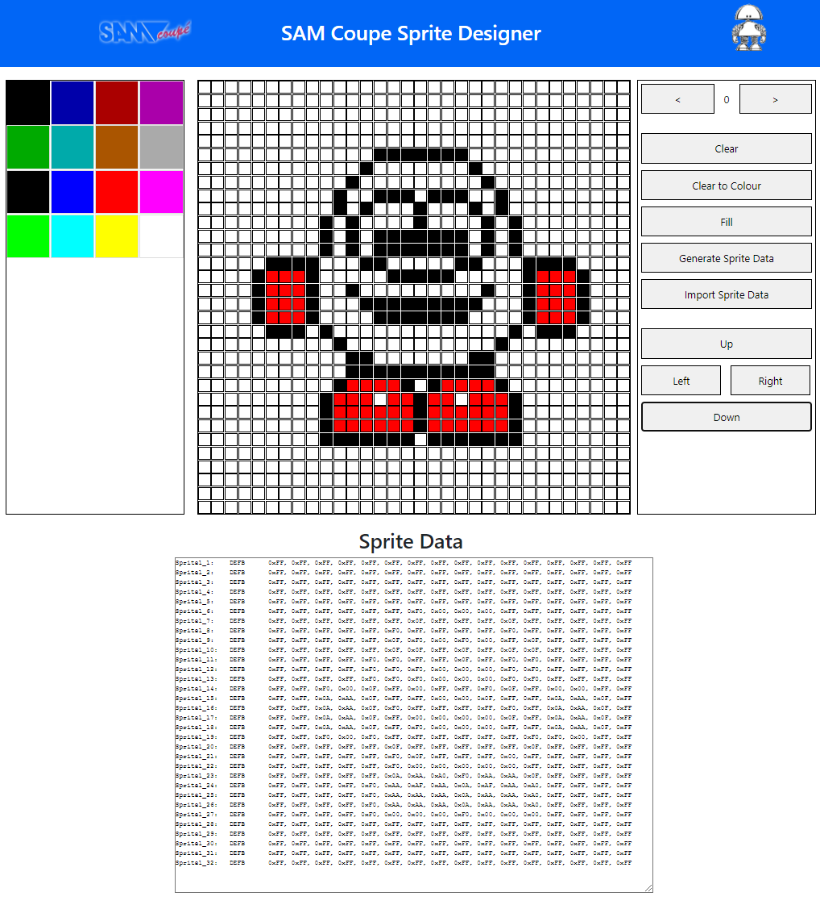

# The SAM Coupe Sprite Editor

This code is a simple SAM Coupe Sprite Editor that allows you to design Sprites for the SAM Coupe using it's standard Pallete and export them as Sprite Data.



## How to use

You can use this to generate sprites that work with my SAM Coupe Graphics in Assembler tutorial here;

https://www.petecodes.co.uk/graphics-in-assembler-for-the-sam-coupe/

## Export Format

An example of the export format is;

```
Sprite1_1:    DEFB      0xFF, 0xFF, 0xFF, 0xFF, 0xFF, 0xFF, 0xFF, 0xFF, 0xFF, 0xFF, 0xFF, 0xFF, 0xFF, 0xFF, 0xFF, 0xFF
Sprite1_2:    DEFB      0xFF, 0xFF, 0xFF, 0xFF, 0xFF, 0xFF, 0xFF, 0xFF, 0xFF, 0xFF, 0xFF, 0xFF, 0xFF, 0xFF, 0xFF, 0xFF
Sprite1_3:    DEFB      0xFF, 0xFF, 0xFF, 0xFF, 0xFF, 0xFF, 0xFF, 0xFF, 0xFF, 0xFF, 0xFF, 0xFF, 0xFF, 0xFF, 0xFF, 0xFF
Sprite1_4:    DEFB      0xFF, 0xFF, 0xFF, 0xFF, 0xFF, 0xFF, 0xFF, 0xFF, 0xFF, 0xFF, 0xFF, 0xFF, 0xFF, 0xFF, 0xFF, 0xFF
Sprite1_5:    DEFB      0xFF, 0xFF, 0xFF, 0xFF, 0xFF, 0xFF, 0xFF, 0xFF, 0xFF, 0xFF, 0xFF, 0xFF, 0xFF, 0xFF, 0xFF, 0xFF
Sprite1_6:    DEFB      0xFF, 0xFF, 0xFF, 0xFF, 0xFF, 0xFF, 0xF0, 0x00, 0x00, 0x00, 0xFF, 0xFF, 0xFF, 0xFF, 0xFF, 0xFF
Sprite1_7:    DEFB      0xFF, 0xFF, 0xFF, 0xFF, 0xFF, 0xFF, 0x0F, 0xFF, 0xFF, 0xFF, 0x0F, 0xFF, 0xFF, 0xFF, 0xFF, 0xFF
Sprite1_8:    DEFB      0xFF, 0xFF, 0xFF, 0xFF, 0xFF, 0xF0, 0xFF, 0xFF, 0xFF, 0xFF, 0xF0, 0xFF, 0xFF, 0xFF, 0xFF, 0xFF
Sprite1_9:    DEFB      0xFF, 0xFF, 0xFF, 0xFF, 0xFF, 0x0F, 0xF0, 0x00, 0xF0, 0x00, 0xFF, 0x0F, 0xFF, 0xFF, 0xFF, 0xFF
Sprite1_10:   DEFB      0xFF, 0xFF, 0xFF, 0xFF, 0xFF, 0x0F, 0x0F, 0xFF, 0x0F, 0xFF, 0x0F, 0x0F, 0xFF, 0xFF, 0xFF, 0xFF
Sprite1_11:   DEFB      0xFF, 0xFF, 0xFF, 0xFF, 0xF0, 0xF0, 0xFF, 0xFF, 0x0F, 0xFF, 0xF0, 0xF0, 0xFF, 0xFF, 0xFF, 0xFF
Sprite1_12:   DEFB      0xFF, 0xFF, 0xFF, 0xFF, 0xF0, 0xF0, 0xF0, 0x00, 0x00, 0x00, 0xF0, 0xF0, 0xFF, 0xFF, 0xFF, 0xFF
Sprite1_13:   DEFB      0xFF, 0xFF, 0xFF, 0xFF, 0xF0, 0xF0, 0xF0, 0x00, 0x00, 0x00, 0xF0, 0xF0, 0xFF, 0xFF, 0xFF, 0xFF
Sprite1_14:   DEFB      0xFF, 0xFF, 0xF0, 0x00, 0x0F, 0xFF, 0x00, 0xFF, 0xFF, 0xF0, 0x0F, 0xFF, 0x00, 0x00, 0xFF, 0xFF
Sprite1_15:   DEFB      0xFF, 0xFF, 0x0A, 0xAA, 0x0F, 0xFF, 0xFF, 0x00, 0x00, 0x0F, 0xFF, 0xFF, 0x0A, 0xAA, 0x0F, 0xFF
Sprite1_16:   DEFB      0xFF, 0xFF, 0x0A, 0xAA, 0x0F, 0xF0, 0xFF, 0xFF, 0xFF, 0xFF, 0xF0, 0xFF, 0x0A, 0xAA, 0x0F, 0xFF
Sprite1_17:   DEFB      0xFF, 0xFF, 0x0A, 0xAA, 0x0F, 0xFF, 0x00, 0x00, 0x00, 0x00, 0x0F, 0xFF, 0x0A, 0xAA, 0x0F, 0xFF
Sprite1_18:   DEFB      0xFF, 0xFF, 0x0A, 0xAA, 0x0F, 0xFF, 0xF0, 0x00, 0x00, 0x00, 0xFF, 0xFF, 0x0A, 0xAA, 0x0F, 0xFF
Sprite1_19:   DEFB      0xFF, 0xFF, 0xF0, 0x00, 0xF0, 0xFF, 0xFF, 0xFF, 0xFF, 0xFF, 0xFF, 0xF0, 0xF0, 0x00, 0xFF, 0xFF
Sprite1_20:   DEFB      0xFF, 0xFF, 0xFF, 0xFF, 0xFF, 0x0F, 0xFF, 0xFF, 0xFF, 0xFF, 0xFF, 0x0F, 0xFF, 0xFF, 0xFF, 0xFF
Sprite1_21:   DEFB      0xFF, 0xFF, 0xFF, 0xFF, 0xFF, 0xF0, 0x0F, 0xFF, 0xFF, 0xFF, 0x00, 0xFF, 0xFF, 0xFF, 0xFF, 0xFF
Sprite1_22:   DEFB      0xFF, 0xFF, 0xFF, 0xFF, 0xFF, 0xF0, 0x00, 0x00, 0x00, 0x00, 0x00, 0xFF, 0xFF, 0xFF, 0xFF, 0xFF
Sprite1_23:   DEFB      0xFF, 0xFF, 0xFF, 0xFF, 0xFF, 0x0A, 0xAA, 0xA0, 0xF0, 0xAA, 0xAA, 0x0F, 0xFF, 0xFF, 0xFF, 0xFF
Sprite1_24:   DEFB      0xFF, 0xFF, 0xFF, 0xFF, 0xF0, 0xAA, 0xAF, 0xAA, 0x0A, 0xAF, 0xAA, 0xA0, 0xFF, 0xFF, 0xFF, 0xFF
Sprite1_25:   DEFB      0xFF, 0xFF, 0xFF, 0xFF, 0xF0, 0xAA, 0xAA, 0xAA, 0x0A, 0xAA, 0xAA, 0xA0, 0xFF, 0xFF, 0xFF, 0xFF
Sprite1_26:   DEFB      0xFF, 0xFF, 0xFF, 0xFF, 0xF0, 0xAA, 0xAA, 0xAA, 0x0A, 0xAA, 0xAA, 0xA0, 0xFF, 0xFF, 0xFF, 0xFF
Sprite1_27:   DEFB      0xFF, 0xFF, 0xFF, 0xFF, 0xF0, 0x00, 0x00, 0x00, 0xF0, 0x00, 0x00, 0x00, 0xFF, 0xFF, 0xFF, 0xFF
Sprite1_28:   DEFB      0xFF, 0xFF, 0xFF, 0xFF, 0xFF, 0xFF, 0xFF, 0xFF, 0xFF, 0xFF, 0xFF, 0xFF, 0xFF, 0xFF, 0xFF, 0xFF
Sprite1_29:   DEFB      0xFF, 0xFF, 0xFF, 0xFF, 0xFF, 0xFF, 0xFF, 0xFF, 0xFF, 0xFF, 0xFF, 0xFF, 0xFF, 0xFF, 0xFF, 0xFF
Sprite1_30:   DEFB      0xFF, 0xFF, 0xFF, 0xFF, 0xFF, 0xFF, 0xFF, 0xFF, 0xFF, 0xFF, 0xFF, 0xFF, 0xFF, 0xFF, 0xFF, 0xFF
Sprite1_31:   DEFB      0xFF, 0xFF, 0xFF, 0xFF, 0xFF, 0xFF, 0xFF, 0xFF, 0xFF, 0xFF, 0xFF, 0xFF, 0xFF, 0xFF, 0xFF, 0xFF
Sprite1_32:   DEFB      0xFF, 0xFF, 0xFF, 0xFF, 0xFF, 0xFF, 0xFF, 0xFF, 0xFF, 0xFF, 0xFF, 0xFF, 0xFF, 0xFF, 0xFF, 0xFF
```
